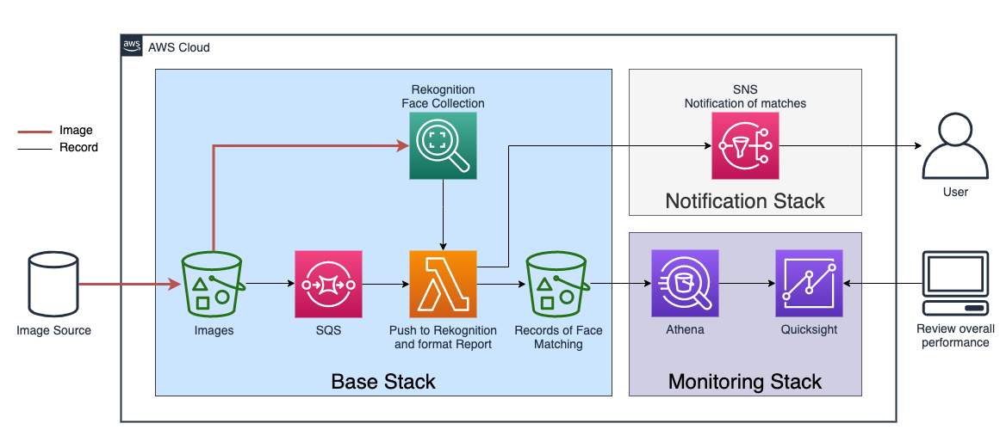

# Face Matching using Amazon Rekognition

[Amazon Rekognition](https://aws.amazon.com/rekognition) Image allows one to find similar faces in a large collection of images. You can create an index of faces detected in your images. Rekognition Image’s fast and accurate search returns faces that best match your reference face.

This solution demonstrate how to leverage the facial recognition features of Rekognition to identify images of the same persons under different names.


## Solution Architecture Overview
The solution is designed for asynchronously add the faces to Rekognition catalog and report all the matches with already stored faces.


The process flow:

1. Images containing faces are uploaded to S3 bucket `Images`
2. The file creation in the `Images` bucket generate an event tha tis passed to a dedicate queue in SQS
2. The processing Lambda function consumes events from the queue:  
    a. Invokes Rekognition `index_faces` API with the image URI  
    b. Invokes the `search_faces` Rekognition API with the face index id  
    c. Uploads a reports of all matches as a json file in the output bucket
2. An Amazon Athena table allows querying the matching reports
2. Aggregated statistics based on the reports can be visualized in Amazon Quicksight
2. Event matches with similarity score above a set threshold are published into an SNS topic, to be distributed as notifications.

## 


## Deployment
Deployment requires
- An [AWS Account](https://aws.amazon.com/account/)
- Docker Desktop installed and running
- **Understood that this solution may consume services outside the [Free Tier](https://aws.amazon.com/free), which will be chargeable**


The architecture is described and can be deployed using [AWS Cloud Development Kit (AWS CDK)](https://aws.amazon.com/cdk/). For an in-depth description of CDK and instructions on how to install it, a great place to start is the [CDK documentation](https://docs.aws.amazon.com/cdk/latest/guide/home.html)

For the purposes of deploying this solution, here's a brief guide:

1. **Configure AWS Profile**  
Create a profile matching the AWS account and IAM user (or role) with enough privileges to deploy the solution. You can find the instructions [here](https://docs.aws.amazon.com/sdkref/latest/guide/creds-config-files.html).
1. **Clone this repository**
2. **Install cdk**  
assuming that node is already installed in the system, running 
    ```
    $ npm install
    ```
    from inside the project directory (i.e. where `package.json` is located) will install the correct version of CDK. It might not be the latest, and CDK doesn't guarantee backward compatibility, so better to stick to the version indicated in the `package.json` file.
3. **Create a python virtual environment**  
    there are multiple ways to create a virtual environment in Python. This project uses [Poetry](https://python-poetry.org/). To create the venv and install all the necessary packages:
    ```
    $ poetry install
    ```
4. **Activate the Python virtual environment**  
After the init process completes and the virtualenv is created, you can use the following
step to activate your virtualenv.

    ```
    $ poetry shell
    ```

5. **Deploy**

    ```
    $ cdk deply --all
    ```

